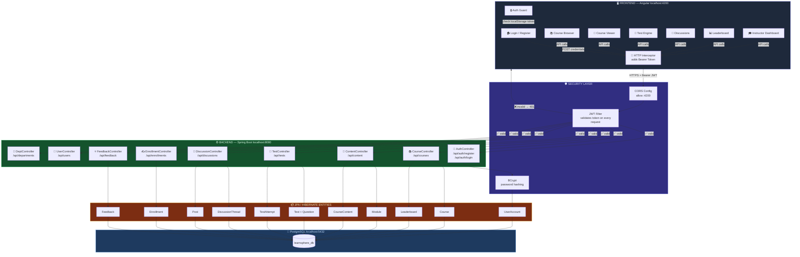
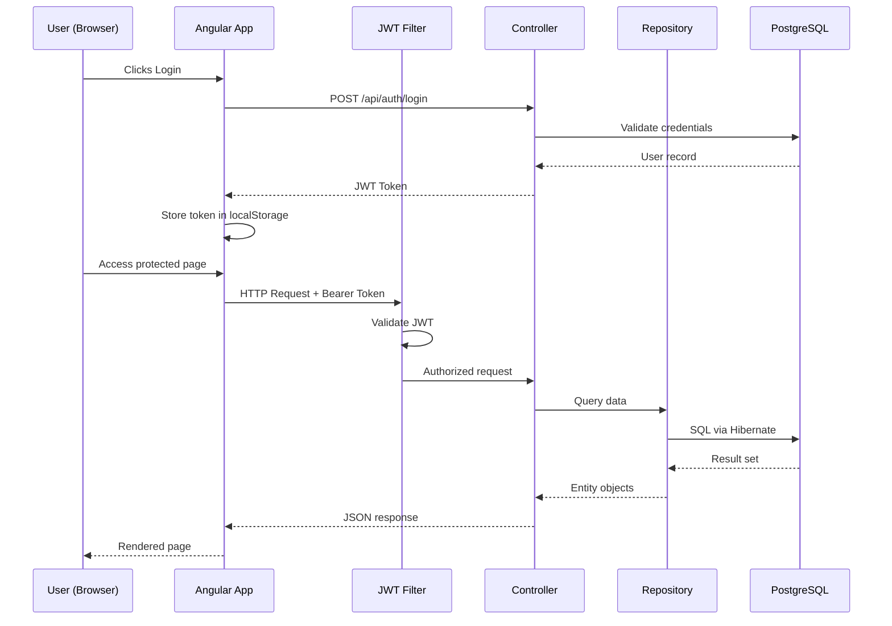
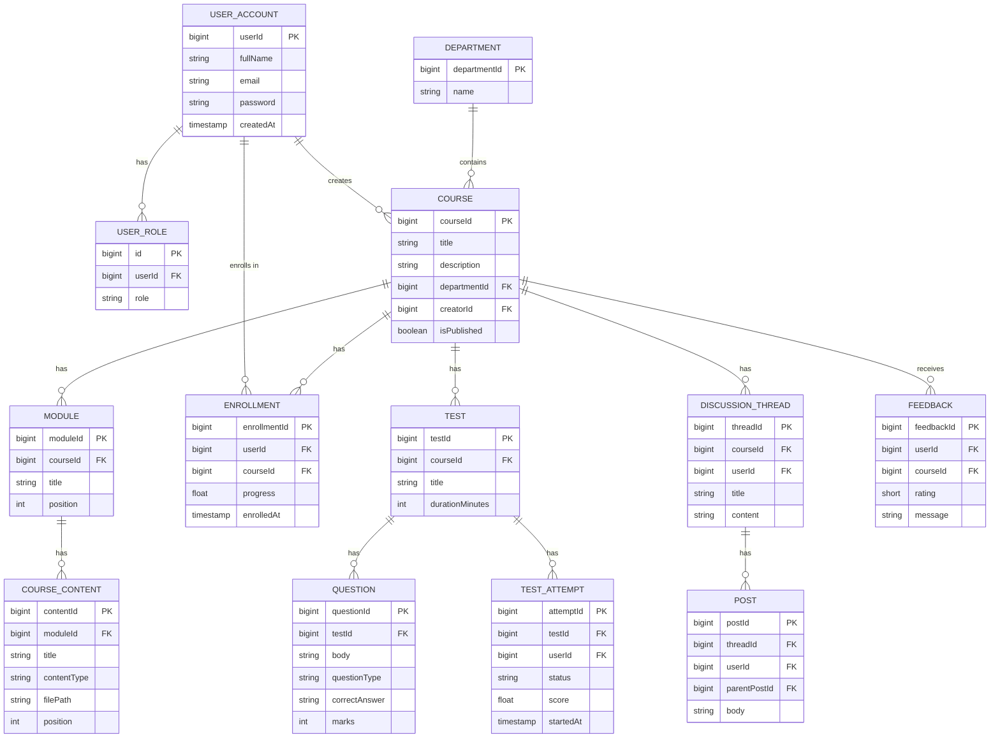
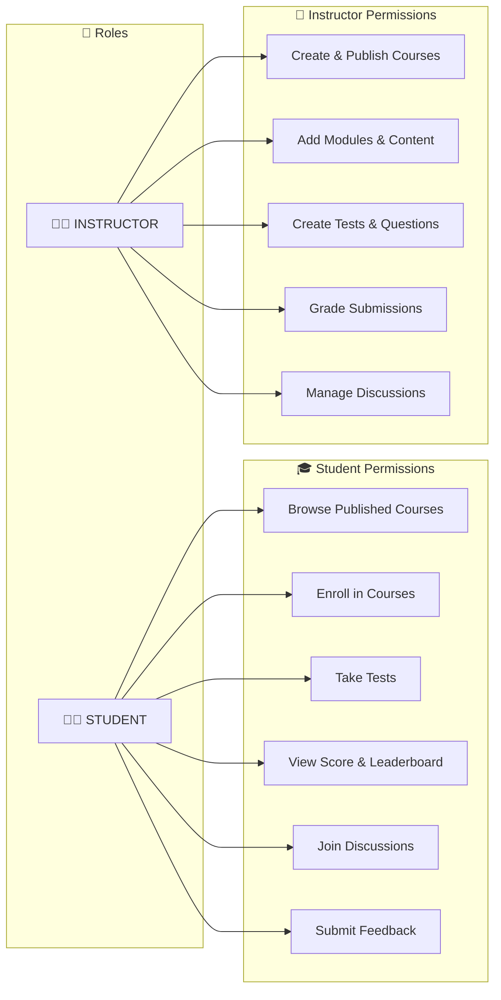
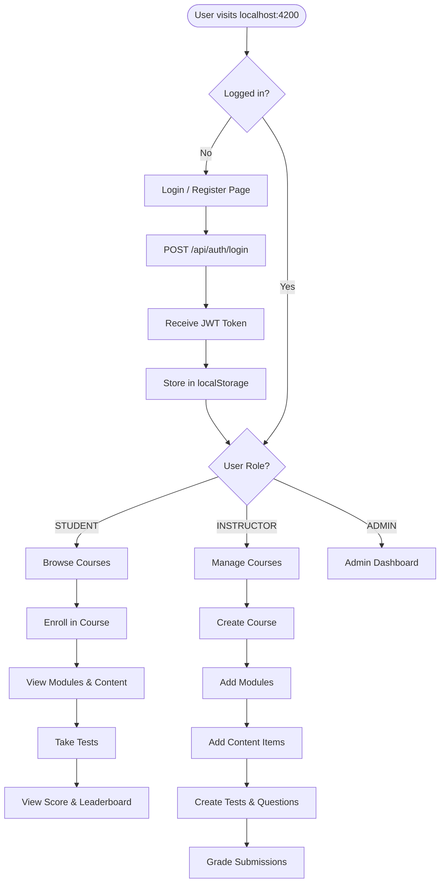
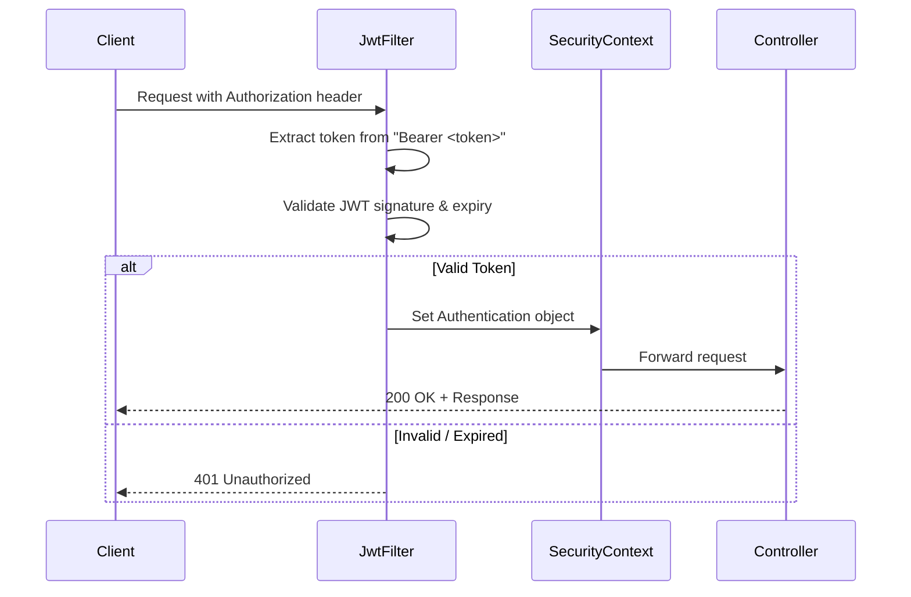

<div align="center">

# 🌐 LearnSphere

### *Next-Generation Learning Management System*

[](https://openjdk.java.net/)
[](https://spring.io/projects/spring-boot)
[](https://angular.io/)
[](https://www.postgresql.org/)
[](https://jwt.io/)
[](LICENSE)

**A full-stack, enterprise-grade Learning Management System — built with Spring Boot, Angular, and PostgreSQL.**

[Overview](#-overview) • [Architecture](#-architecture) • [Setup Guide](#-setup-guide) • [API Reference](#-api-reference) • [Troubleshooting](#-troubleshooting)

---

</div>

## 📌 Overview

LearnSphere is a complete LMS platform covering the entire academic workflow — from user registration and course creation to assessments, discussion forums, and real-time progress tracking.

| Layer | Technology |
|---|---|
| **Frontend** | Angular 17, TypeScript |
| **Backend** | Java 21, Spring Boot 3.x, Spring Security |
| **Database** | PostgreSQL 12+ |
| **Auth** | JWT (Stateless) + BCrypt |
| **ORM** | Hibernate / JPA |
| **Build** | Maven (Backend), npm (Frontend) |

---

## ✨ Features

| Feature | Description |
|---|---|
| 🔐 **JWT Authentication** | Stateless token-based auth with role-based access (Student / Instructor / Admin) |
| 🏫 **Department Hierarchy** | Organize courses and users under academic departments |
| 📚 **Course Management** | Full CRUD — create, publish, manage modules and content items |
| 📝 **Assessment Engine** | MCQ, Text, and True/False questions with auto-grading |
| 📊 **Leaderboards** | Real-time global and departmental ranking |
| 💬 **Discussion Forums** | Threaded discussions per course with nested replies |
| 🎯 **Progress Tracking** | Per-student progress per content item |
| ⭐ **Feedback System** | Course ratings and review messages |
| 🔄 **Lifecycle Hooks** | `@PrePersist` for automatic timestamps and status |

---

## 🗂 Repository Structure

```
LearnSphere/
├── backend/              ← Spring Boot Java application
│   ├── src/
│   │   └── main/
│   │       ├── java/com/learnsphere/backend/
│   │       │   ├── controller/   ← REST API controllers
│   │       │   ├── entity/       ← JPA database models
│   │       │   ├── repository/   ← Data access layer
│   │       │   ├── security/     ← JWT, filters, config
│   │       │   ├── dto/          ← Request/Response DTOs
│   │       │   └── config/       ← App configuration
│   │       └── resources/
│   │           └── application.properties
│   ├── pom.xml
│   └── mvnw
│
├── Frontend/             ← Angular 17 application
│   ├── src/
│   │   ├── app/          ← Components, services, guards
│   │   └── environments/
│   ├── angular.json
│   └── package.json
│
├── server/               ← Node.js utility scripts
│   └── seed.js           ← Database seeding script
│
└── readme/               ← All documentation
    ├── README.md
    ├── QUICKSTART.md
    ├── POSTGRESQL_SETUP.md
    ├── INTEGRATION_GUIDE.md
    └── CHANGES_SUMMARY.md
```

---

## 🏗 Architecture

### 🗺️ Full System Overview



### Request Flow



### Database Entity Relationship



### Role-Based Access Control



---

## 🚀 Setup Guide

### Prerequisites

Install the following before proceeding:

| Tool | Version | Download |
|---|---|---|
| **JDK** | 21+ | https://adoptium.net/ |
| **Maven** | 3.x | https://maven.apache.org/ |
| **Node.js** | 18+ | https://nodejs.org/ |
| **PostgreSQL** | 12+ | https://www.postgresql.org/download/ |
| **Git** | Any | https://git-scm.com/ |

---

### Step 1 — Clone the Repository

```bash
git clone https://github.com/Chetanyadav1606/LearnSphere.git
cd LearnSphere
```

---

### Step 2 — Set Up PostgreSQL

**Option A: Using psql (command line)**

```powershell
# Open psql as postgres user
psql -U postgres

# Inside psql, create the database
CREATE DATABASE learnsphere_db;

# Verify it exists
\l

# Exit
\q
```

**Option B: Using pgAdmin (GUI)**
1. Open pgAdmin from Start Menu
2. Connect to `localhost:5432`
3. Right-click **Databases** → **Create** → **Database**
4. Name: `learnsphere_db` → Click **Save**

---

### Step 3 — Configure the Backend

Open `backend/src/main/resources/application.properties`:

```properties
# Server
server.port=8080

# PostgreSQL
spring.datasource.url=jdbc:postgresql://localhost:5432/learnsphere_db
spring.datasource.username=postgres
spring.datasource.password=root           # ← Change to your PostgreSQL password

spring.datasource.driver-class-name=org.postgresql.Driver

# Hibernate — auto-creates tables on first run
spring.jpa.hibernate.ddl-auto=update
spring.jpa.show-sql=true
spring.jpa.properties.hibernate.format_sql=true
spring.jpa.open-in-view=false
```

> **Note:** If your PostgreSQL password is not `root`, update it here before starting the backend.

---

### Step 4 — Start the Backend

```powershell
cd backend
.\mvnw spring-boot:run
```

**Expected output:**
```
  .   ____          _            __ _ _
 /\\ / ___'_ __ _ _(_)_ __  __ _ \ \ \ \
...
Started LearnSphereApplication in 8.5 seconds (process running for 9.1)
```

✅ Backend is running at **http://localhost:8080**

**Verify it works:**
```powershell
curl http://localhost:8080/api/courses
# Expected: [] (empty array)
```

---

### Step 5 — Start the Frontend

Open a **new terminal window**:

```powershell
cd Frontend
npm install          # First time only — installs all dependencies
npm run start
```

**Expected output:**
```
✔ Compiled successfully.
Angular Live Development Server is listening on localhost:4200
```

✅ Frontend is running at **http://localhost:4200**

---

### Step 6 — Seed Sample Data (Optional)

To populate the database with demo users, a sample course, test, and content:

```powershell
cd server
node seed.js
```

**Output:**
```
Registering Faculty...
Registering Student...
Creating Department...
Creating Course...
Creating Module...
Creating Content...
Creating Test...
Seeding complete!
==========================================
CREDENTIALS:
Faculty Email: faculty@learnsphere.com | Password: password123
Student Email: student@learnsphere.com | Password: password123
```

---

### Step 7 — Access the Application

Open your browser and go to: **http://localhost:4200**

| Role | Email | Password |
|---|---|---|
| Instructor | faculty@learnsphere.com | password123 |
| Student | student@learnsphere.com | password123 |

---

## Application Flow



---

## 🔌 API Reference

> All endpoints (except Auth) require the header: `Authorization: Bearer <jwt_token>`

### 🔐 Authentication

| Method | Endpoint | Description | Auth Required |
|---|---|---|---|
| POST | `/api/auth/register` | Register a new user | ❌ |
| POST | `/api/auth/login` | Login and get JWT token | ❌ |

**Register:**
```bash
curl -X POST http://localhost:8080/api/auth/register \
  -H "Content-Type: application/json" \
  -d '{"fullName":"John Doe","email":"john@test.com","password":"pass123","role":"STUDENT"}'
```

**Login:**
```bash
curl -X POST http://localhost:8080/api/auth/login \
  -H "Content-Type: application/json" \
  -d '{"email":"john@test.com","password":"pass123"}'
# Returns: JWT token string
```

---

### 🏫 Departments

| Method | Endpoint | Description |
|---|---|---|
| POST | `/api/departments` | Create department |
| GET | `/api/departments` | Get all departments |
| GET | `/api/departments/{id}` | Get department by ID |

---

### 📚 Courses

| Method | Endpoint | Description |
|---|---|---|
| POST | `/api/courses` | Create a new course |
| GET | `/api/courses` | Get all courses |
| GET | `/api/courses/published` | Get published courses only |
| GET | `/api/courses/{id}` | Get course by ID |
| PUT | `/api/courses/{id}` | Update course |
| DELETE | `/api/courses/{id}` | Delete course |

**Create Course:**
```json
POST /api/courses
{
  "title": "Introduction to Java",
  "description": "Learn Java from scratch",
  "isPublished": true,
  "department": { "departmentId": 1 },
  "creator": { "userId": 1 }
}
```

---

### 📖 Content Management

| Method | Endpoint | Description |
|---|---|---|
| POST | `/api/content/module` | Create a module |
| GET | `/api/content/module/course/{courseId}` | Get modules for a course |
| POST | `/api/content/item` | Add content item to module |
| GET | `/api/content/item/module/{moduleId}` | Get items in a module |

**Create Module:**
```json
POST /api/content/module
{
  "course": { "courseId": 1 },
  "title": "Getting Started",
  "position": 1
}
```

**Add Content Item:**
```json
POST /api/content/item
{
  "module": { "moduleId": 1 },
  "title": "Variables and Types",
  "contentType": "VIDEO",
  "filePath": "https://youtube.com/watch?v=example",
  "position": 1
}
```
> `contentType`: `VIDEO`, `PDF`, or `QUIZ`

---

### ✍️ Enrollments

| Method | Endpoint | Description |
|---|---|---|
| POST | `/api/enrollments` | Enroll in a course |
| GET | `/api/enrollments/user/{userId}` | Get user's enrollments |
| GET | `/api/enrollments/course/{courseId}` | Get all enrollments for course |

---

### 📝 Assessments

| Method | Endpoint | Description |
|---|---|---|
| POST | `/api/tests` | Create a test |
| GET | `/api/tests/course/{courseId}` | Get tests for a course |
| POST | `/api/tests/question` | Add question to test |
| POST | `/api/tests/attempt` | Start a test attempt |
| POST | `/api/tests/answer` | Submit an answer |
| PUT | `/api/tests/attempt/{id}/submit` | Submit test attempt |
| PUT | `/api/tests/attempt/{id}/grade` | Grade a submission |

> `questionType`: `MCQ`, `TEXT`, or `TRUE_FALSE`

---

### 💬 Discussions

| Method | Endpoint | Description |
|---|---|---|
| POST | `/api/discussions/thread` | Create discussion thread |
| GET | `/api/discussions/course/{courseId}` | Get threads for a course |
| POST | `/api/discussions/post` | Add post / reply |
| GET | `/api/discussions/thread/{id}/posts` | Get posts in a thread |

---

### ⭐ Feedback

| Method | Endpoint | Description |
|---|---|---|
| POST | `/api/feedback` | Submit feedback |
| GET | `/api/feedback/course/{courseId}` | Get feedback for a course |

---

## 🔒 Security Architecture



- **BCrypt** — Passwords are hashed before storage, never stored as plaintext
- **Stateless JWT** — No sessions on server; each request is self-contained
- **Role Guards** — Angular route guards prevent unauthorized page access
- **CORS** — Configured to allow only `http://localhost:4200` in development

---

## 🧪 Testing the API

### Using curl

```powershell
# 1. Register an instructor
curl -X POST http://localhost:8080/api/auth/register `
  -H "Content-Type: application/json" `
  -d '{"fullName":"Prof. Smith","email":"prof@test.com","password":"pass123","role":"INSTRUCTOR"}'

# 2. Login and save token
$token = (curl -X POST http://localhost:8080/api/auth/login `
  -H "Content-Type: application/json" `
  -d '{"email":"prof@test.com","password":"pass123"}').Content

# 3. Create a department
curl -X POST http://localhost:8080/api/departments `
  -H "Authorization: Bearer $token" `
  -H "Content-Type: application/json" `
  -d '{"name":"Computer Science"}'

# 4. Get all courses
curl http://localhost:8080/api/courses `
  -H "Authorization: Bearer $token"
```

### Using Postman

1. Import the base URL: `http://localhost:8080`
2. Set `Content-Type: application/json` in Headers
3. After login, copy the JWT token
4. Add header `Authorization: Bearer <your_token>` to protected requests

---

## ❗ Troubleshooting

### Backend won't start

| Error | Fix |
|---|---|
| `Failed to configure a DataSource` | PostgreSQL is not running. Start it via Services or `pg_ctl start` |
| `FATAL: password authentication failed` | Update `spring.datasource.password` in `application.properties` |
| `database "learnsphere_db" does not exist` | Run `CREATE DATABASE learnsphere_db;` in psql |
| `Port 8080 already in use` | Run `netstat -ano \| findstr :8080` and kill the process |

### Frontend won't start

| Error | Fix |
|---|---|
| `npm install` fails | Delete `node_modules/` folder and run `npm install` again |
| `ng: command not found` | Run `npm install -g @angular/cli` |
| Blank page at localhost:4200 | Check browser console (F12) for errors |

### API / Auth issues

| Error | Fix |
|---|---|
| `401 Unauthorized` | Token expired or missing — login again |
| `403 Forbidden` | Your role doesn't have access to this endpoint |
| `CORS blocked` | Make sure backend is running on port 8080 |
| Frontend can't reach backend | Check proxy config at `Frontend/proxy.conf.json` |

### Verify PostgreSQL is running (Windows)

```powershell
# Check if postgres service is running
Get-Service -Name "postgresql*"

# Start it if stopped
Start-Service -Name "postgresql-x64-16"  # Adjust version number
```

---

## 🤝 Contributing

1. 🍴 Fork the repository
2. 🌿 Create a feature branch: `git checkout -b feature/your-feature`
3. 💾 Commit your changes: `git commit -m 'feat: add your feature'`
4. 📤 Push to branch: `git push origin feature/your-feature`
5. 🔃 Open a Pull Request

**Guidelines:**
- Follow Java naming conventions
- Write unit tests for new endpoints
- Keep DTOs separate from entities
- Use meaningful commit messages (prefer `feat:`, `fix:`, `docs:` prefixes)

---

<div align="center">

### 👨‍💻 Developer

**Chetan Yadav**
*Lead Architect & Full-Stack Developer*

[](https://github.com/Chetanyadav1606)

---

### ⭐ Star this repository if you find it helpful!

*Building the future of education, one commit at a time.* 🚀

</div>
